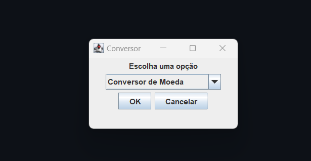
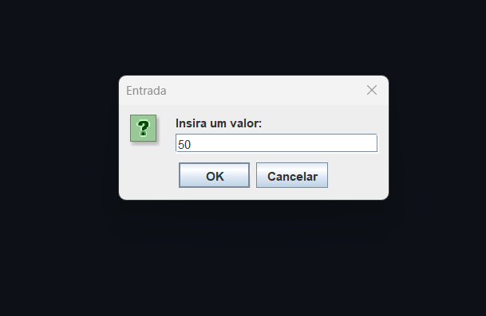
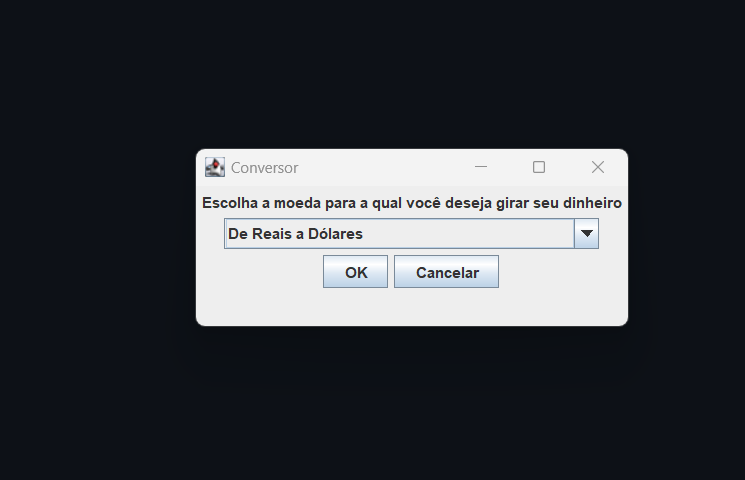
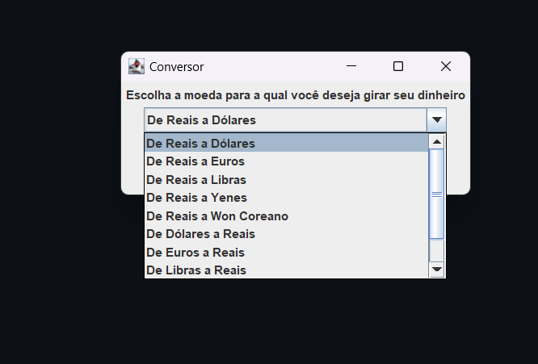
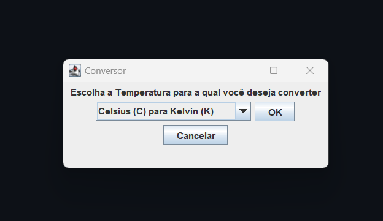
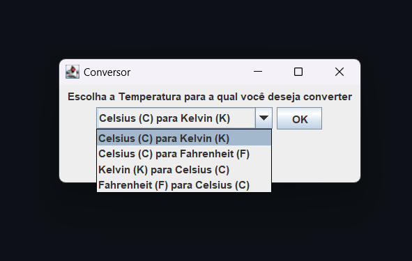
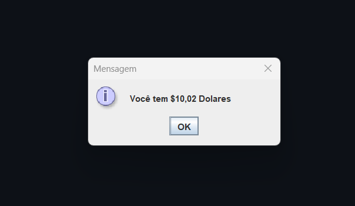
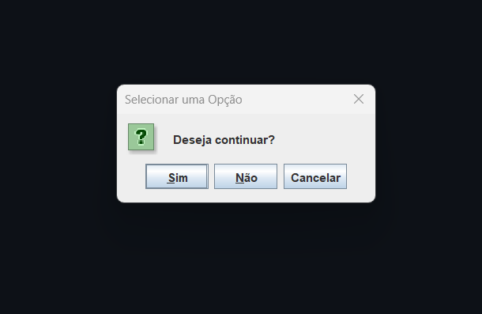
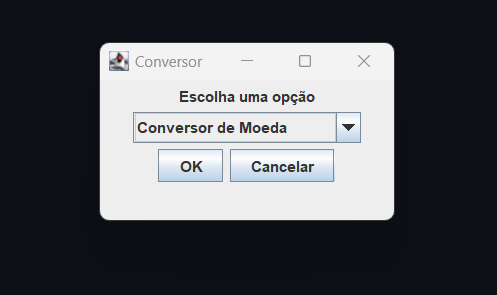
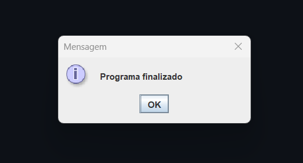

# Conversor de Moeda e Conversor de Temperatura  | ONE - Oracle Next Education | Challenge Back End Java - Conversor
 Status : Concluido ! 

## Sobre o Projeto
---
- Resultado do Challenge Back End Java da ONE - Oracle Next Education
- Sistema de Conversor de Temperatura e Moeda
## Funcionalidades 
##### Conversor de Moedas Permite converter valor digitado de : 
- Reais para Dólares
- Reais para Euros
- Reais para Libras
- Reais para Yenes
- Reais para Won Coreano
- Dólares para Reais
- Euros para Reais
- Libras para Reais
- Yenes para Reais
- Won Coreano a Reais
##### Conversor de Temperatura Permite converter valor digitado de :
- Celsius (C) para Kelvin (K)
- Celsius (C) para Fahrenheit (F)
- Kelvin (K) para Celsius (C)
- Fahrenheit (F) para Celsius (C)

 ## Tecnologias Utilizadas
````
 Java - AWT - SWING 
````

## Imagem Previa 
---
♦ Primeira Janela 
<p align="center" >
     
</p>
♦ Selecionando Conversor de Temperatura ou Conversor de Moeda  
<p align="center" >
     
</p>
♦ No caso de escolher : Conversor de Moeda  
<p align="center" >
     
</p>

<p align="center" >
     
</p>

♦ No caso de escolher : Conversor de Temperatura  
<p align="center" >
     
</p>

<p align="center" >
     
</p>

♦ Resposta Conversor de Moeda  
<p align="center" >
     
</p>

♦ Resposta Conversor de Temperatura  
<p align="center" >
     
</p>

♦ Pergunta Final   
<p align="center" >
     
</p>

♦ Se pergunta final for "Sim" (recomeça para converte novo valor)  
<p align="center" >
     
</p>

♦ Se pergunta final for "Não" ou "Cancelar" (Finaliza Programa)  
<p align="center" >
     
</p>

Badge pela Conclusão do Desafio
---
► https://d335luupugsy2.cloudfront.net/cms%2Ffiles%2F10224%2F1671211937Prancheta_8.png?utm_campaign=alura_latam_-_challenge_email_projeto_5_br&utm_medium=email&utm_source=RD+Station
<p align="center" >

</p>


